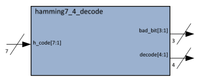

# Lab 2: Encoder Design - Error Correction Code (Week 4)

## Overview

In this lab, you will design a **Hamming(7,4) encoder** that takes 4 data bits and produces 7 output bits with error detection and correction capability. This is a fundamental concept in digital systems, memory design, and communications.

## Learning Objectives

After completing this lab, you will be able to:

1. Understand the concept of **Error Correction Codes (ECC)** and their importance
2. Learn **Hamming code** encoding principles
3. Implement a 4-bit to 7-bit encoder using **XOR parity calculations**
4. Verify the encoder operation through simulation

---

## Background: Hamming(7,4) Code

### Why Error Correction?

Digital systems are susceptible to noise and interference that can cause bit errors. In critical applications (memory, storage, communication), we need mechanisms to detect and correct these errors.

### Hamming Code Structure

The Hamming(7,4) code encodes **4 data bits** (d3, d2, d1, d0) into **7 code bits** by adding **3 parity bits** (p2, p1, p0):

| Position | 7 | 6 | 5 | 4 | 3 | 2 | 1 |
|----------|---|---|---|---|---|---|---|
| Bit | d3 | d2 | d1 | p2 | d0 | p1 | p0 |

### Parity Bit Calculation

Each parity bit covers specific data bit positions:

```
p0 = d0 ⊕ d1 ⊕ d3    (covers positions 1, 3, 5, 7)
p1 = d0 ⊕ d2 ⊕ d3    (covers positions 2, 3, 6, 7)
p2 = d1 ⊕ d2 ⊕ d3    (covers positions 4, 5, 6, 7)
```

<div style="text-align:center">

<p><em>Figure 1: Hamming(7,4) Encoder Block Diagram</em></p>
</div>

---

## Design Specification

### Block Diagram

```
            ┌───────────────────────────────────┐
    d[3:0]  │                                   │  code[6:0]
   ─────────┤       Hamming(7,4) Encoder        ├──────────
   (4 bits) │                                   │  (7 bits)
            └───────────────────────────────────┘
```

### Module Interface

```systemverilog
module hamming74_encoder (
    input  logic [3:0] data_in,     // 4 data bits: d3, d2, d1, d0
    output logic [6:0] code_out     // 7-bit Hamming code
);
```

### Truth Table (Partial)

| d3 | d2 | d1 | d0 | p2 | p1 | p0 | code_out |
|----|----|----|----|----|----|----|----------|
| 0  | 0  | 0  | 0  | 0  | 0  | 0  | 7'b0000000 |
| 0  | 0  | 0  | 1  | 0  | 1  | 1  | 7'b0000111 |
| 0  | 0  | 1  | 0  | 1  | 0  | 1  | 7'b0010101 |
| 0  | 1  | 0  | 0  | 1  | 1  | 0  | 7'b0101110 |
| 1  | 0  | 0  | 0  | 1  | 1  | 1  | 7'b1001111 |
| 1  | 1  | 1  | 1  | 1  | 1  | 1  | 7'b1111111 |

---

## SystemVerilog Implementation

### Template Code

```systemverilog
module hamming74_encoder (
    input  logic [3:0] data_in,     // d3, d2, d1, d0
    output logic [6:0] code_out     // {d3, d2, d1, p2, d0, p1, p0}
);

    // Extract individual data bits for clarity
    logic d3, d2, d1, d0;
    logic p2, p1, p0;
    
    assign {d3, d2, d1, d0} = data_in;
    
    // Calculate parity bits using XOR
    assign p0 = d0 ^ d1 ^ d3;    // Parity for positions 1,3,5,7
    assign p1 = d0 ^ d2 ^ d3;    // Parity for positions 2,3,6,7
    assign p2 = d1 ^ d2 ^ d3;    // Parity for positions 4,5,6,7
    
    // Construct output: {d3, d2, d1, p2, d0, p1, p0}
    assign code_out = {d3, d2, d1, p2, d0, p1, p0};
    
endmodule
```

### Alternative Using Continuous Assignment

```systemverilog
module hamming74_encoder (
    input  logic [3:0] data_in,
    output logic [6:0] code_out
);

    assign code_out[0] = data_in[0] ^ data_in[1] ^ data_in[3]; // p0
    assign code_out[1] = data_in[0] ^ data_in[2] ^ data_in[3]; // p1
    assign code_out[2] = data_in[0];                           // d0
    assign code_out[3] = data_in[1] ^ data_in[2] ^ data_in[3]; // p2
    assign code_out[4] = data_in[1];                           // d1
    assign code_out[5] = data_in[2];                           // d2
    assign code_out[6] = data_in[3];                           // d3
    
endmodule
```

---

## Hardware Implementation

### Top-Level Wrapper

Your `lab2_top.sv` module should connect the encoder to the DE10-Lite switches and LEDs:

```systemverilog
module lab2_top (
    input  logic [9:0] SW,      // Slide switches
    output logic [9:0] LEDR     // Red LEDs
);

    // Instantiate Hamming encoder
    // SW[3:0] → data input
    // LEDR[6:0] → encoded output
    
    hamming74_encoder u_encoder (
        .data_in  (SW[3:0]),
        .code_out (LEDR[6:0])
    );
    
    // Unused LEDs
    assign LEDR[9:7] = 3'b0;
    
endmodule
```

### Pin Assignments

| Signal | FPGA Pin | Component |
|--------|----------|-----------|
| SW[0] | PIN_C10 | Switch 0 (d0) |
| SW[1] | PIN_C11 | Switch 1 (d1) |
| SW[2] | PIN_D12 | Switch 2 (d2) |
| SW[3] | PIN_C12 | Switch 3 (d3) |
| LEDR[0] | PIN_A8 | LED 0 (p0) |
| LEDR[1] | PIN_A9 | LED 1 (p1) |
| LEDR[2] | PIN_A10 | LED 2 (d0) |
| LEDR[3] | PIN_B10 | LED 3 (p2) |
| LEDR[4] | PIN_D13 | LED 4 (d1) |
| LEDR[5] | PIN_C13 | LED 5 (d2) |
| LEDR[6] | PIN_E14 | LED 6 (d3) |

---

## Verification

### Testing Procedure

1. Set all switches OFF (0000) → LEDs should show 0000000
2. Set SW[0] ON (0001) → LEDs should show 0000111
3. Set SW[3] ON only (1000) → LEDs should show 1001111
4. Try all 16 combinations and verify parity bits

### Simulation Testbench

Create a testbench to verify all 16 input combinations:

```systemverilog
module hamming74_encoder_tb;
    logic [3:0] data_in;
    logic [6:0] code_out;
    
    hamming74_encoder uut (.*);
    
    initial begin
        $display("Data In | Code Out | p2 p1 p0");
        $display("--------|----------|----------");
        
        for (int i = 0; i < 16; i++) begin
            data_in = i;
            #10;
            $display("  %b  |  %b  |  %b  %b  %b", 
                     data_in, code_out, 
                     code_out[3], code_out[1], code_out[0]);
        end
        
        $finish;
    end
endmodule
```

---

## Lab Manual

📄 [Download Lab 2 Manual (PDF)](lab2_v9.pdf)

---

## Deliverables

- [ ] **SystemVerilog Design**: `hamming74_encoder.sv` and `lab2_top.sv`
- [ ] **Testbench**: `hamming74_encoder_tb.sv`
- [ ] **Simulation Waveform**: Screenshot showing all 16 test cases
- [ ] **Hardware Demo**: Demonstrate encoder operation on DE10-Lite
- [ ] **Individual Report**: Include block diagram, code, and verification results
- [ ] **Submission**: Upload `lab2_top.svf` file

---

## Related Resources

- 📖 [Wikipedia: Hamming(7,4) Code](https://en.wikipedia.org/wiki/Hamming(7,4))
- 📖 [EDA Playground for Simulation](https://www.edaplayground.com/)
- ➡️ [Lab 4: Hamming Decoder](lab4.md) - The corresponding decoder design
