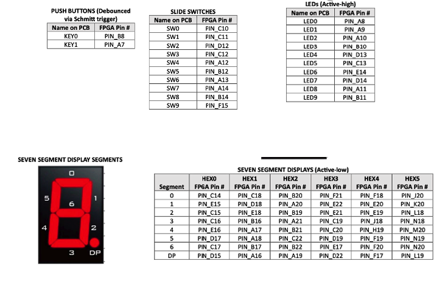
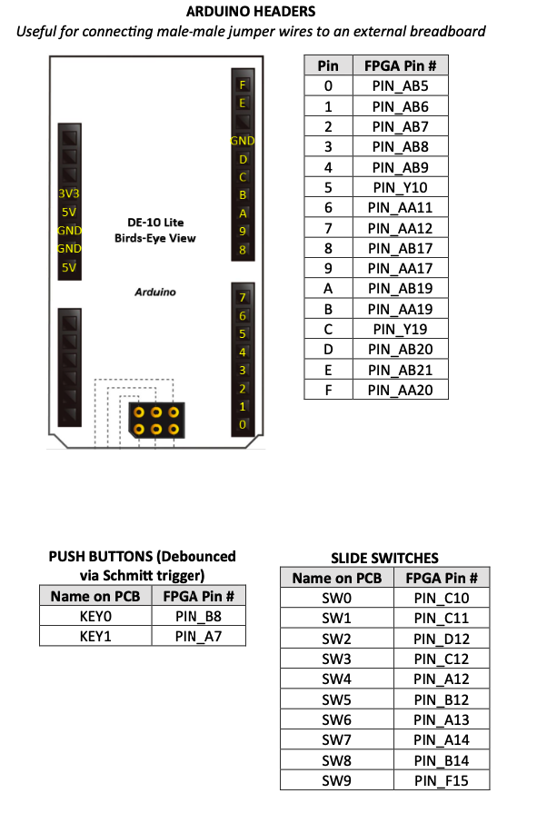

# Lab 3A – Connecting to the DE10-Lite Hardware

## Introduction

In a previous lab, you designed some simple logical gates and tested the design in hardware. The hardware connections were done automatically for you in the templates provided. In this lab, you will learn how these connections are done through the naming of signals in a top-level wrapper.

The mapping of the SystemVerilog top-level signals to the actual hardware device can be a pretty tedious operation. The mapping is defined in a file called a **Quartus Settings File** (with a `.qsf` extension). There exists extensive documentation on setting up such a file for a particular design.

### Why This Matters

Fortunately, the board manufacturer (Terasic), along with the tool provider (Altera), provide a support `.qsf` file from which we can edit this connection information for our particular design. In this lab, you will be editing this file so that you can correctly connect your design to the hardware in Lab 3, where you will be designing a seven-segment decoder.

### Lab 3 Design Preview

The main design module for Lab 3 is named: **`lab3_decoder`**. It will have:
- **Seven input signals** (connected to seven input switches)
- **Eleven output signals** (connected to the seven-segment display)

In addition to modifying the Quartus Settings File, you will also be enabling the proper I/O signals within the **`DE10_LITE_Temple_Top.sv`** file.

---

## Understanding the QSF File

Within the lab directory, there is a file called **`lab3_top.qsf`**. This file contains all of the usable input and output connections on the FPGA defined with respect to their connection to the peripheral hardware. The signals are grouped by functionality.

### Pin-to-Signal Mapping

The QSF file defines mappings like:
- Hardware **pin A8** → `led 0`
- Hardware **pin C10** → `switch 0`
- etc.

On the DE10-Lite board, there are **10 switches**, numbered 0-9, using signal name **`sw`**, which is a multi-bit or bussed signal. So `sw[9]` refers to switch number 9, etc.

<div style="text-align:center">

<p><em>Figure: DE10-Lite FPGA pin assignments showing LEDs, switches, and seven-segment displays</em></p>
</div>

### Vendor Support Files

> **Note:** It is beyond the scope of this lab and course to delve into the details of this format. However, it is important to see the connections and the top-level signal names in case you need to change them in future designs. Most often when you purchase a piece of hardware like this, the vendor will supply the appropriate support files for the board. So typically you would only have to do some minor edits of their master file.

### Comment Format

The format for this file allows for comments. If the first non-space character in the line is a **`#`** symbol, the line is treated as a comment – similar to the format of shell scripts and Python programming.

> ⚠️ **Important:** Looking at the master file, all of these useful lines of code are commented out! That is their default – **no pin is connected**. So we need to uncomment the ones being used (by removing the `#` symbol for the signals of interest in your design).

---

## The Wrapper File

After the pins are connected to the proper signals, these signals must be **enabled** in the wrapper file (**`DE10_LITE_Temple_Top.sv`**). This is accomplished by defining macros at the top of the file.

<div style="text-align:center">

<p><em>Figure: Arduino header pin connections on the DE10-Lite board</em></p>
</div>

---

## Design Specification and Steps

The goal of this lab is to step through a process to modify a Quartus Settings File that will be used for Labs 3A and 3. This exercise will teach you how the top-level signals in your designs are connected to the hardware switches, LEDs, push buttons, etc.

> **Note:** In future labs, the `.qsf` files will be provided to you.

---

## Part A – Modifying the QSF File

### Step 1: Open the QSF File

Open the **`lab3_top.qsf`** file in VS Code.

### Step 2: Uncomment Required Signals

Proceed to uncomment (i.e., remove the `#` symbol) the lines for the following signals:

| Signal Group | Signal Names | Approximate Lines |
|--------------|--------------|-------------------|
| All LEDs | `ledr[0]` through `ledr[9]` | Lines 73-92 |
| Switches 0-6 | `sw[0]` through `sw[6]` | Lines 95-108 |
| Seven-segment displays 0-3 | `hex0` through `hex3` | Lines 117-180 |

### Step 3: Save the File

Save the file. You should now have a Quartus Settings File for use in Labs 3A and 3.

---

## Part B – Editing the Top Module

### Step 1: Open the Wrapper File

Open the top module: **`DE10_LITE_Temple_Top.sv`**.

### Step 2: Understanding `ifdef/endif` Directives

Note how all of the I/O data sets are grouped. Each grouping is bracketed by an **`` `ifdef/`endif ``** directive. You can read more about these SystemVerilog constructs in the language reference. Essentially, this directive tells the compiler to include this portion of the code **if** a specific FLAG macro is **defined**.

For example, consider this code pattern:

```systemverilog
`ifdef ENABLE_LED
    output logic [9:0] ledr
`endif
```

The LED bus `ledr[9:0]` will only be defined if the `ENABLE_LED` macro is included. Otherwise, the compiler will ignore this segment of the code, which may cause issues if the design makes use of the LEDs on the DE10-Lite hardware.

### Step 3: Define Required Macros

In this lab, we need the following signals to be defined:

| Signal Group | Macro to Define |
|--------------|-----------------|
| All LEDs | `ENABLE_LED` |
| Switches 0-6 | `ENABLE_SW` |
| Seven-segment display 0 | `ENABLE_HEX0` |
| Seven-segment display 1 | `ENABLE_HEX1` |
| Seven-segment display 2 | `ENABLE_HEX2` |
| Seven-segment display 3 | `ENABLE_HEX3` |

These macros can be defined at the top of the wrapper file. Use the `` `define `` directive:

```systemverilog
`define ENABLE_LED
`define ENABLE_SW
`define ENABLE_HEX0
`define ENABLE_HEX1
`define ENABLE_HEX2
`define ENABLE_HEX3
```

> **Important:** Place only **one macro per line**. You can begin defining your macros on line 29 as instructed by the comments in the file.

### Step 4: Create a Simple Design

Now, create a simple design inside the top-level module. Connect the seven input switches to the first seven LEDs. This can be done with a single assign statement:

```systemverilog
assign ledr[6:0] = sw[6:0];
```

---

## Simulation/Verification

Because the design is so simple – connecting seven inputs to seven outputs – there is no simulation necessary.

---

## Synthesis and Hardware Testing

### Step 1: Save All Files

Make sure all of your files are saved.

### Step 2: Run Synthesis

Run the synthesis by right-clicking and running: **`lab3_top.qsf`**

### Step 3: Test on Hardware

Download your binary file (**`lab3_top.svf`**) using the [SVF Loader](https://temple.short.gy/svfloader) and test your design.

**Expected behavior:** Toggling switches 0-6 should light up the corresponding LEDs 0-6.

---

## Preparation for Lab 3

Once Lab 3A is complete, prepare the wrapper for Lab 3:

### Step 1: Comment Out Lab 3A Code

Open **`DE10_LITE_Temple_Top.sv`** and comment out your Lab 3A connections (the simple switch-to-LED assignment).

### Step 2: Understand the Display Architecture

Previously, when this lab used the Basys board, each display had its own anode that had to be toggled individually. Additionally, segments between displays shared common cathodes. Thus, the same pattern would show on all four displays at once.

According to the **DE10-Lite User Manual**, each segment of each display can be toggled separately, thus eliminating the need for an "anode" decoder. This is why we had to enable all eight signals (seven segments plus a decimal point) for each display:
- `hex0[0]` - `hex0[7]`
- `hex1[0]` - `hex1[7]`
- `hex2[0]` - `hex2[7]`
- `hex3[0]` - `hex3[7]`

However, to keep the code consistent, we will still create an anode decoder module so that we can select which display we want turned on. To facilitate compatibility with the DE10-Lite board, the **`muxed_display`** module is already instantiated for you.

### Step 3: Instantiate the Lab 3 Decoder

In order to complete the instantiation, include the **`lab3_decoder`** module. Within the instantiation, connect the switches as the inputs. Two internal signals have already been declared:
- `an[3:0]` – anode control
- `cathode[6:0]` – segment cathodes

Simply insert your instantiation where the comment reads: "instantiate top level design here":

```systemverilog
lab3_decoder u_top (.sw(sw), .an(an), .cathode(cathode));
```

> **Note:** You will not see any errors you make in this instantiation until you synthesize the design in Lab 3. However, you can check for the correct syntax of your edits by running **`lab3_top.qsf`**.

---

## Summary

| Task | File to Edit | Action |
|------|--------------|--------|
| Uncomment pin assignments | `lab3_top.qsf` | Remove `#` from LED, switch, and hex display lines |
| Enable I/O macros | `DE10_LITE_Temple_Top.sv` | Add `` `define `` statements |
| Lab 3A design | `DE10_LITE_Temple_Top.sv` | Connect switches to LEDs |
| Lab 3 preparation | `DE10_LITE_Temple_Top.sv` | Instantiate `lab3_decoder` |

---

## Deliverables

- [ ] Modified `lab3_top.qsf` with uncommented signals
- [ ] Modified `DE10_LITE_Temple_Top.sv` with macros defined
- [ ] Screenshot showing switches controlling LEDs
- [ ] Submission of `lab3_top.svf` file

## Lab Manual

📄 [Download Lab 3A Manual (PDF)](lab3a_v2.pdf)
