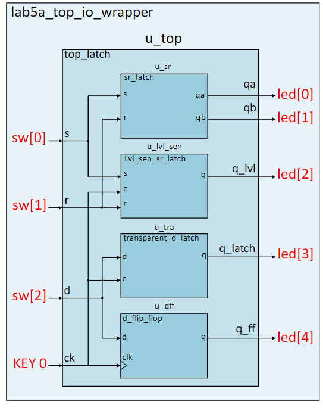

# Lab 5: Combinational Shift Logic (Week 9)

## Overview

In this lab, you will implement various types of **shifters** - fundamental building blocks used in arithmetic operations, data manipulation, and serial-to-parallel conversions. You will design combinational shift circuits including logical, arithmetic, circular, and barrel shifters.

## Learning Objectives

After completing this lab, you will be able to:

1. Understand different types of **shift operations** and their applications
2. Implement **logical shift left/right** operations
3. Implement **arithmetic shift** with proper sign extension
4. Design **circular (rotate) shift** operations
5. Build a **barrel shifter** for variable shift amounts

---

## Background: Types of Shift Operations

### Logical Shift

**Logical shift** inserts zeros in the vacated bit positions:

```
Logical Shift Left (<<):
  Before: 0101_1010
  << 2:   0110_1000  (zeros inserted on right)

Logical Shift Right (>>):
  Before: 0101_1010
  >> 2:   0001_0110  (zeros inserted on left)
```

### Arithmetic Shift

**Arithmetic shift** preserves the sign bit during right shifts (sign extension):

```
Arithmetic Shift Right (>>>):
  Before: 1101_1010 (negative number in 2's complement)
  >>> 2:  1111_0110  (sign bit replicated)
  
  Before: 0101_1010 (positive number)
  >>> 2:  0001_0110  (zero replicated - same as logical)
```

<div style="text-align:center">

<p><em>Figure 1: Types of Shift Operations</em></p>
</div>

### Circular Shift (Rotate)

**Circular shift** wraps bits around - no bits are lost:

```
Rotate Left:
  Before: 1010_0011
  ROL 3:  0001_1101  (top 3 bits move to bottom)

Rotate Right:
  Before: 1010_0011
  ROR 3:  0111_0100  (bottom 3 bits move to top)
```

### Barrel Shifter

A **barrel shifter** can shift by any amount in a single clock cycle, making it very fast for variable shift operations.

---

## Design Specifications

### Basic Shifter Module

```systemverilog
module shifter (
    input  logic [7:0] data_in,     // 8-bit input data
    input  logic [2:0] shift_amt,   // Shift amount (0-7)
    input  logic [1:0] shift_type,  // 00: LL, 01: LR, 10: AR, 11: ROT
    input  logic       direction,   // 0: left, 1: right
    output logic [7:0] data_out     // 8-bit output
);
```

### Shift Type Encoding

| shift_type | Operation |
|------------|-----------|
| 2'b00 | Logical Shift Left |
| 2'b01 | Logical Shift Right |
| 2'b10 | Arithmetic Shift Right |
| 2'b11 | Rotate (direction selects L/R) |

---

## SystemVerilog Implementation

### Simple Logical Shifter

```systemverilog
module logical_shifter (
    input  logic [7:0] data_in,
    input  logic [2:0] shift_amt,
    input  logic       direction,    // 0 = left, 1 = right
    output logic [7:0] data_out
);

    always_comb begin
        if (direction == 1'b0)
            data_out = data_in << shift_amt;  // Left shift
        else
            data_out = data_in >> shift_amt;  // Right shift
    end

endmodule
```

### Arithmetic Shifter

```systemverilog
module arithmetic_shifter (
    input  logic signed [7:0] data_in,  // Signed input
    input  logic [2:0] shift_amt,
    output logic signed [7:0] data_out
);

    // Arithmetic right shift (>>> operator)
    assign data_out = data_in >>> shift_amt;

endmodule
```

### Circular Shifter (Rotator)

```systemverilog
module circular_shifter (
    input  logic [7:0] data_in,
    input  logic [2:0] shift_amt,
    input  logic       direction,    // 0 = left, 1 = right
    output logic [7:0] data_out
);

    always_comb begin
        if (direction == 1'b0) begin
            // Rotate Left: high bits wrap to low
            data_out = (data_in << shift_amt) | (data_in >> (8 - shift_amt));
        end else begin
            // Rotate Right: low bits wrap to high
            data_out = (data_in >> shift_amt) | (data_in << (8 - shift_amt));
        end
    end

endmodule
```

### Barrel Shifter (Complete)

```systemverilog
module barrel_shifter (
    input  logic [7:0] data_in,
    input  logic [2:0] shift_amt,    // 0-7 shift positions
    input  logic [1:0] shift_type,   // Type of shift
    output logic [7:0] data_out
);

    logic [7:0] stage0, stage1, stage2;
    logic msb;
    
    assign msb = data_in[7];  // Sign bit for arithmetic shift
    
    // Stage 0: Shift by 1 (if shift_amt[0])
    always_comb begin
        case (shift_type)
            2'b00: stage0 = shift_amt[0] ? {data_in[6:0], 1'b0} : data_in;     // SLL
            2'b01: stage0 = shift_amt[0] ? {1'b0, data_in[7:1]} : data_in;     // SRL
            2'b10: stage0 = shift_amt[0] ? {msb, data_in[7:1]} : data_in;      // SRA
            2'b11: stage0 = shift_amt[0] ? {data_in[0], data_in[7:1]} : data_in; // ROR
            default: stage0 = data_in;
        endcase
    end
    
    // Stage 1: Shift by 2 (if shift_amt[1])
    always_comb begin
        case (shift_type)
            2'b00: stage1 = shift_amt[1] ? {stage0[5:0], 2'b00} : stage0;
            2'b01: stage1 = shift_amt[1] ? {2'b00, stage0[7:2]} : stage0;
            2'b10: stage1 = shift_amt[1] ? {{2{msb}}, stage0[7:2]} : stage0;
            2'b11: stage1 = shift_amt[1] ? {stage0[1:0], stage0[7:2]} : stage0;
            default: stage1 = stage0;
        endcase
    end
    
    // Stage 2: Shift by 4 (if shift_amt[2])
    always_comb begin
        case (shift_type)
            2'b00: stage2 = shift_amt[2] ? {stage1[3:0], 4'b0000} : stage1;
            2'b01: stage2 = shift_amt[2] ? {4'b0000, stage1[7:4]} : stage1;
            2'b10: stage2 = shift_amt[2] ? {{4{msb}}, stage1[7:4]} : stage1;
            2'b11: stage2 = shift_amt[2] ? {stage1[3:0], stage1[7:4]} : stage1;
            default: stage2 = stage1;
        endcase
    end
    
    assign data_out = stage2;

endmodule
```

---

## Hardware Implementation

### Top-Level Wrapper

```systemverilog
module lab5_top (
    input  logic [9:0] SW,      // Switches: SW[7:0]=data, SW[9:8]=type
    input  logic [1:0] KEY,     // KEY[0]=direction, KEY[1]=unused
    output logic [9:0] LEDR,    // Red LEDs: output data
    output logic [6:0] HEX0,    // Display input low nibble
    output logic [6:0] HEX1,    // Display input high nibble
    output logic [6:0] HEX2,    // Display output low nibble
    output logic [6:0] HEX3     // Display output high nibble
);

    logic [7:0] data_out;
    logic [2:0] shift_amt;
    
    // Fixed shift amount for demo (or use additional switches)
    assign shift_amt = 3'd2;  // Shift by 2 positions
    
    barrel_shifter u_shifter (
        .data_in    (SW[7:0]),
        .shift_amt  (shift_amt),
        .shift_type (SW[9:8]),
        .data_out   (data_out)
    );
    
    assign LEDR[7:0] = data_out;
    assign LEDR[9:8] = SW[9:8];  // Show shift type
    
    // Seven-segment displays for visualization
    svn_seg_decoder u_hex0 (.bcd_in(SW[3:0]),      .display_on(1'b1), .seg_out(HEX0));
    svn_seg_decoder u_hex1 (.bcd_in(SW[7:4]),      .display_on(1'b1), .seg_out(HEX1));
    svn_seg_decoder u_hex2 (.bcd_in(data_out[3:0]),.display_on(1'b1), .seg_out(HEX2));
    svn_seg_decoder u_hex3 (.bcd_in(data_out[7:4]),.display_on(1'b1), .seg_out(HEX3));

endmodule
```

---

## Verification

### Testing Procedure

| Test | Input | Type | Shift | Expected Output |
|------|-------|------|-------|-----------------|
| 1 | 8'b0000_0001 | SLL | 3 | 8'b0000_1000 |
| 2 | 8'b1000_0000 | SRL | 3 | 8'b0001_0000 |
| 3 | 8'b1000_0000 | SRA | 3 | 8'b1111_0000 |
| 4 | 8'b1010_0001 | ROR | 4 | 8'b0001_1010 |

### Simulation Testbench

```systemverilog
module barrel_shifter_tb;
    logic [7:0] data_in, data_out;
    logic [2:0] shift_amt;
    logic [1:0] shift_type;
    
    barrel_shifter uut (.*);
    
    initial begin
        // Test Shift Left Logical
        data_in = 8'b0000_0001;
        shift_type = 2'b00;
        shift_amt = 3'd3;
        #10;
        $display("SLL: %b << %d = %b", 8'b0000_0001, shift_amt, data_out);
        
        // Test Shift Right Logical
        data_in = 8'b1000_0000;
        shift_type = 2'b01;
        shift_amt = 3'd3;
        #10;
        $display("SRL: %b >> %d = %b", 8'b1000_0000, shift_amt, data_out);
        
        // Test Arithmetic Shift Right (negative)
        data_in = 8'b1000_0000;
        shift_type = 2'b10;
        shift_amt = 3'd3;
        #10;
        $display("SRA: %b >>> %d = %b", 8'b1000_0000, shift_amt, data_out);
        
        // Test Rotate Right
        data_in = 8'b1010_0001;
        shift_type = 2'b11;
        shift_amt = 3'd4;
        #10;
        $display("ROR: %b ror %d = %b", 8'b1010_0001, shift_amt, data_out);
        
        $finish;
    end
endmodule
```

---

## Lab Manual

📄 [Download Lab 5 Manual (PDF)](lab5_v10.pdf)

---

## Deliverables

- [ ] **SystemVerilog Design**: `barrel_shifter.sv` and `lab5_top.sv`
- [ ] **Testbench**: Verify all shift types and amounts
- [ ] **Simulation Waveform**: Screenshot of all shift operations
- [ ] **Hardware Demo**: Demonstrate shifter on DE10-Lite
- [ ] **Individual Report**: Include design analysis and verification
- [ ] **Submission**: Upload `lab5_top.svf` file

---

## Applications of Shifters

- **Multiplication/Division by powers of 2**: Left/right shifts
- **Bit field extraction**: Shift and mask operations
- **Serial-to-parallel conversion**: Shift registers
- **CRC calculations**: XOR with shifts
- **Cryptography**: Rotate operations in encryption algorithms
